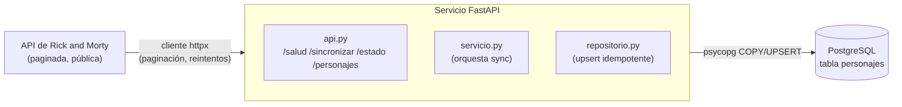

<div align="center">

# Ingestor API

**Microservicio de ingestión API-first con FastAPI hacia PostgreSQL: paginación, reintentos e idempotencia**

[](https://github.com/JuanAlvarezgh/ingestor-api/actions/workflows/ci.yml)


</div>

Microservicio de ingestión **API-first**: un servicio HTTP construido con **FastAPI** que ingiere datos
de una API pública paginada hacia **PostgreSQL** de forma **idempotente**, con manejo de paginación,
reintentos y rate-limit, y expone endpoints para disparar y consultar la ingestión. Reproducible con
`docker compose up`.

## Objetivo

Demostrar el lado **software** del perfil (diseño de API REST, OpenAPI, contenedores, tests) combinado con
**ingeniería de datos** (extracción paginada, carga idempotente, resiliencia). Es el patrón de un
*connector* propio expuesto como servicio: en vez de un script suelto, la ingestión es una API operable
con endpoints para sincronizar, monitorear y consultar.

La fuente de referencia es la [API pública de Rick and Morty](https://rickandmortyapi.com/) (paginada y
sin API key), pero el cliente está aislado en su propio módulo, de modo que cambiar de fuente no afecta al
resto del servicio.

## Arquitectura



## Tecnologías

| Capa | Herramienta |
|---|---|
| Lenguaje | Python 3.11 |
| API / web | FastAPI + Uvicorn (OpenAPI/Swagger automático) |
| Cliente HTTP | httpx (paginación + backoff exponencial) |
| Persistencia | psycopg 3 → PostgreSQL 16 (upsert idempotente) |
| Validación | Pydantic 2 |
| Infraestructura | Docker + Docker Compose |
| Calidad | pytest, ruff, respx (mock de httpx) |
| CI | GitHub Actions |

## Qué se construyó

- **Cliente HTTP resiliente** (`ingestor/cliente.py`): pagina la API siguiendo `info.next`, reintenta con
  **backoff exponencial** ante 429/5xx y timeouts, y mapea el JSON al modelo `Personaje`.
- **Repositorio idempotente** (`ingestor/repositorio.py`): `upsert` por clave primaria (`ON CONFLICT`), de
  modo que re-sincronizar nunca duplica; más consultas de conteo, máximo id y listado filtrado.
- **Servicio de sincronización** (`ingestor/servicio.py`): orquesta cliente → repositorio en modo
  **completo** o **incremental** (calcula la página inicial a partir del último id cargado).
- **API FastAPI** (`ingestor/api.py`): 4 endpoints + documentación OpenAPI automática en `/docs`, con
  inyección de dependencias para la conexión a la base de datos por request.
- **Contenedor y CI**: `Dockerfile` + `docker-compose.yml` (servicio + Postgres) y GitHub Actions
  (ruff + pytest contra un Postgres de servicio).

## Endpoints

| Método | Ruta | Descripción |
|---|---|---|
| `GET` | `/salud` | Verifica que el servicio está en línea. |
| `POST` | `/sincronizar?incremental=false` | Dispara la ingestión (completa o incremental) y devuelve un resumen. |
| `GET` | `/estado` | Total de registros en la base de datos y máximo id. |
| `GET` | `/personajes?especie=&estado=&limite=&offset=` | Lista los personajes cargados, con filtros. |
| `GET` | `/docs` | Documentación interactiva OpenAPI/Swagger. |

## Decisiones de diseño (el porqué)

- **Ingestión como servicio (API-first).** En lugar de un script, la ingestión se opera por HTTP: se puede
  disparar, monitorear y consultar. Encaja en arquitecturas de microservicios.
- **Idempotencia por `ON CONFLICT`.** Re-sincronizar es seguro: actualiza en lugar de duplicar. La clave
  natural es el `id` del personaje.
- **Resiliencia ante rate-limit.** La API pública aplica límites agresivos (HTTP 429); el cliente los
  absorbe con reintentos y backoff exponencial, en vez de fallar a la primera.
- **Sincronización incremental.** Como la API pagina de 20 en 20 ordenado por id, el modo incremental
  arranca en la página correspondiente al último id cargado, evitando re-descargar todo.
- **Diseño síncrono y testeable.** El cliente y la conexión se inyectan, lo que permite simular la API
  con `respx` y probar la lógica sin red.

## Resultados

- **API funcional**: 4 endpoints REST + OpenAPI automático; el contenedor responde end-to-end
  (`/salud`, `/estado`, `/personajes`, `/docs`).
- **Calidad**: **16 tests** (unitarios del cliente con HTTP simulado, integración del repositorio contra
  Postgres real, y pruebas de la API con `TestClient`), `ruff` limpio, **CI verde**.
- **Catálogo**: la fuente expone **826 personajes en 42 páginas**; el servicio los ingiere de forma
  idempotente, manejando el rate-limit de la API pública mediante reintentos.

## Cómo correrlo

```bash
cp .env.example .env
docker compose up -d --build            # levanta Postgres + el servicio (http://localhost:8000)

curl http://localhost:8000/salud
curl -X POST "http://localhost:8000/sincronizar?incremental=false"
curl http://localhost:8000/estado
curl "http://localhost:8000/personajes?especie=Human&limite=5"
# documentación interactiva: http://localhost:8000/docs
```

Para desarrollo local: `pip install -e ".[dev]"`, levantar solo la base con `docker compose up -d bd`,
exportar `DSN_BD` y correr `uvicorn ingestor.api:app --reload`.

## Calidad y tests

- **`tests/test_cliente.py`**: paginación y mapeo, reintento ante 429 y error tras agotar reintentos (HTTP simulado con `respx`).
- **`tests/test_repositorio.py`**: `upsert` idempotente, conteo, máximo id y listado filtrado contra un Postgres real.
- **`tests/test_api.py`**: los endpoints `/salud`, `/sincronizar`, `/estado` y `/personajes` con `TestClient` y la API upstream simulada.

## Estructura

```
ingestor-api/
├─ ingestor/
│  ├─ config.py        # configuración desde variables de entorno
│  ├─ modelos.py       # modelos Pydantic (Personaje, ResumenSync)
│  ├─ cliente.py       # cliente HTTP paginado y resiliente
│  ├─ repositorio.py   # persistencia idempotente en PostgreSQL
│  ├─ servicio.py      # orquestación de la sincronización
│  └─ api.py           # aplicación FastAPI (endpoints + OpenAPI)
├─ tests/              # pruebas unitarias, de integración y de la API
├─ Dockerfile          # imagen del servicio
├─ docker-compose.yml  # servicio + PostgreSQL
└─ .github/workflows/  # CI
```

## Habilidades

Python, diseño de API REST (FastAPI), OpenAPI, ETL/ingestión, manejo de paginación y rate-limit,
carga idempotente, PostgreSQL, Docker, pytest, Git / CI (GitHub Actions).

---

## Contacto

[](https://www.linkedin.com/in/juanalvarezgh)
[](mailto:juanalvarezghcode@gmail.com)
[](https://github.com/JuanAlvarezgh)
